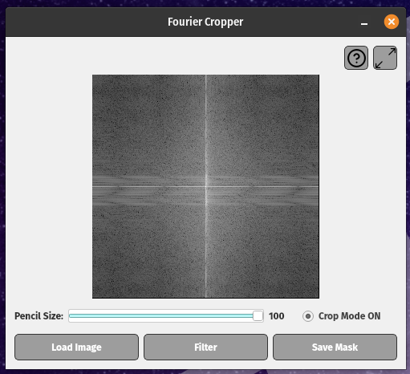
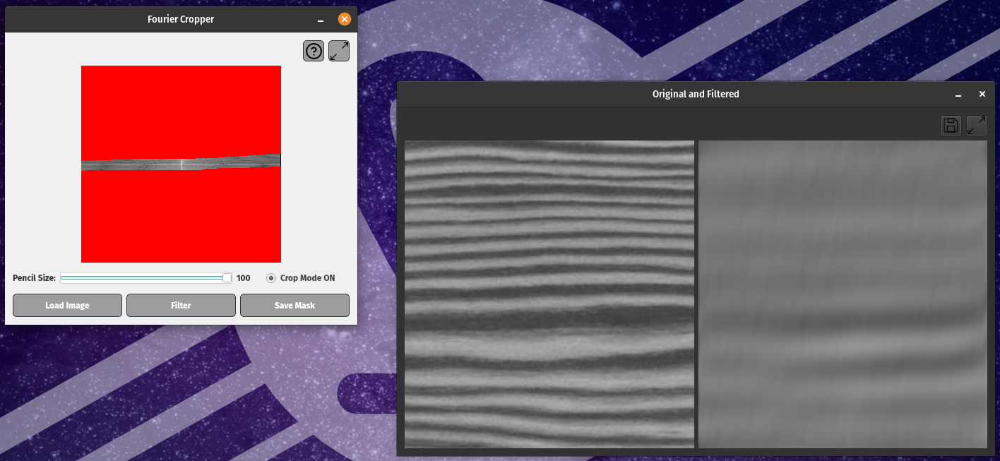

# fourier-cropper
An application to filter an image in the frequency domain interactively

  

  

This project uses [OpenCV 4](https://github.com/opencv/opencv/tree/4.10.0) (see additional packages in https://docs.opencv.org/3.4/d7/d9f/tutorial_linux_install.html)

It is recommended build OpenCV with `-DOPENCV_GENERATE_PKGCONFIG=ON` see [this](https://stackoverflow.com/questions/15320267/package-opencv-was-not-found-in-the-pkg-config-search-path)

_TODO_:
- The idea will be binding all required libraries into a single AppImage, in order to ship the application directly
- Manage both color and grayscale images
- Enable loading a local mask from file
- Download sample images (directional patterns, noisy, etc.)
- Fix max size when loading to drawdiget
